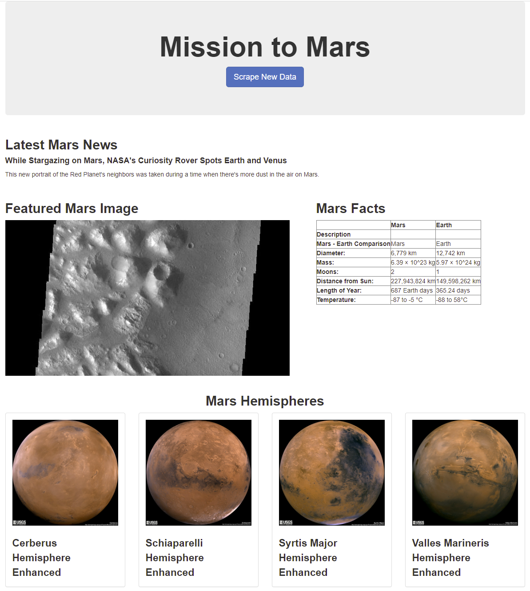

# Web-Scraping Application: Mission to Mars

##### Created by: Estela Perez

##

## Background

The purpose of this challenge was to build a web application that scrapes Mars information from different websites, such as: the latest news from [NASA](https://redplanetscience.com/), Mars featured image from [JPL](https://spaceimages-mars.com/), Mars Facts from 
[Mars Facts website](https://galaxyfacts-mars.com/), and Mars Hemispheres from [Astrogeology site](https://marshemispheres.com/). 
All of this Mission to Mars related data was to be displayed in a single HTML page.

## Dependencies
* Jupyter Notebook, BeautifulSoup, Pandas, and Requests/Splinter was used to conduct the scraping
* MongoDB and Flask was used to display in one HTML page all the scraped information from the provided URLs
* HTML and Python were the languages used

## Visual of Web Application

  
